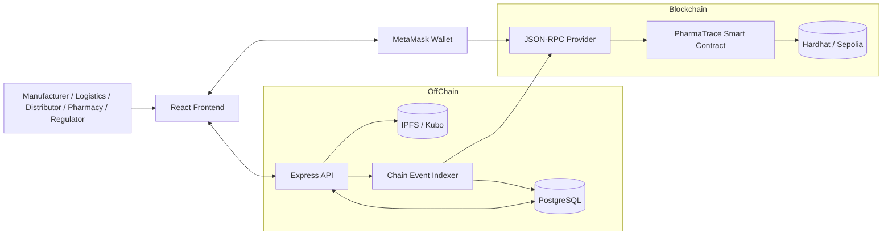

# Phase 1: Project Selection and Justification

## Selected DApp
**TraceChain Pharma: a decentralised pharmaceutical batch provenance and cold-chain traceability platform.**

## Why This Is the Best Choice for Full Marks
This project is the strongest option for the rubric because it balances implementation realism with strong academic depth:

1. **Clear blockchain necessity**  
   Pharmaceutical provenance, custody changes, and recalls benefit directly from an immutable and multi-party audit trail. The blockchain is used for trust-critical state, not as decorative storage.

2. **Strong distributed systems relevance**  
   Manufacturers, logistics firms, distributors, pharmacies, regulators, the API service, IPFS, and blockchain nodes all form a distributed system with autonomous participants and partial trust.

3. **High-quality backend scope**  
   The backend does far more than forward smart-contract calls. It handles signature-based authentication, database storage, telemetry ingestion, IPFS integration, analytics, and event indexing.

4. **High-quality frontend scope**  
   The UI supports dashboards, batch creation, public verification, wallet connect, transaction submission, and operational traceability views, which is much stronger than a simple “connect wallet and click one button” demo.

5. **Excellent report potential**  
   The design creates natural discussion points for consistency trade-offs, transaction finality, fault tolerance, privacy, transparency, security, and performance.

## Learning Outcome Mapping
- `LO1, LO4`: discusses practical and theoretical issues such as latency, consistency, transparency, privacy, and consensus-backed trust.
- `LO2`: presents a clear hybrid architecture with frontend, backend, blockchain, IPFS, and database roles.
- `LO3`: evaluates advantages and drawbacks of hybrid distributed applications.
- `LO5`: implements a complete distributed software application.
- `LO6`: uses multiple platforms and tools including React, Express, Prisma, PostgreSQL, Hardhat, Solidity, MetaMask, viem/wagmi, Docker, and IPFS.
- `LO7`: includes documentation, OpenAPI, architectural explanation, and a technical report.
- `LO8`: includes version-control strategy, code quality tooling, and repository discipline.

# Phase 2: System Design

## High-Level Architecture
TraceChain Pharma uses a hybrid architecture:
- `Frontend`: React + TypeScript + Tailwind operator and public verification interface.
- `Backend`: Express + Prisma + PostgreSQL API for off-chain metadata, telemetry, auth, indexing, and analytics.
- `Blockchain`: Solidity smart contract on Hardhat local chain or Sepolia testnet.
- `Wallet`: MetaMask for user-controlled transaction signing and signature-based API authentication.
- `Storage split`: on-chain for immutable provenance; off-chain for detailed metadata, organisation profiles, telemetry, and IPFS document references.
- `Optional distributed storage`: IPFS/Kubo for supporting documents and compliance artefacts.

## Mermaid Architecture Diagram

## Architectural Responsibilities

### Frontend
- Connects to MetaMask with `wagmi`.
- Authenticates against the backend by signing a nonce message.
- Creates batch drafts through the API.
- Submits smart-contract transactions from the user wallet.
- Displays indexed batch state, on-chain state, and audit timelines.

### Backend
- Issues wallet-signature nonces and verifies signed messages.
- Stores organisation profiles and batch metadata in PostgreSQL.
- Uploads documents to IPFS and persists returned CIDs.
- Ingests telemetry readings and marks anomalies.
- Indexes blockchain events into a query-friendly off-chain projection.
- Serves OpenAPI documentation for API evidence.

### Smart Contract
- Stores trust-critical supply-chain state:
  - batch registration
  - current custodian
  - pending transfer
  - checkpoints
  - recalls
- Emits events for projection and UI updates.
- Enforces RBAC for manufacturers, logistics providers, distributors, pharmacies, and regulators.

## On-Chain vs Off-Chain Data Placement

| Data | Storage | Reason |
|---|---|---|
| Batch ID, manufacturer, current custodian, transfer state, recall state | On-chain | Requires integrity, non-repudiation, and shared trust |
| Metadata hash and document hash | On-chain | Anchors off-chain data immutably |
| Batch description, unit counts, country data, notes | PostgreSQL | Rich query needs and lower cost |
| Telemetry readings and anomaly analytics | PostgreSQL | High volume, frequently updated, not gas-efficient |
| Documents and certificates | IPFS | Distributed content storage with content addressing |
| API sessions, nonces, OpenAPI docs | Backend | Operational concern, not trust-critical |

## Database Schema

### Core Tables
- `Organization`: wallet-linked participant profile and role.
- `Batch`: off-chain metadata, content hashes, chain link, current lifecycle status.
- `Transfer`: off-chain shipment log aligned to on-chain transfer requests.
- `SensorReading`: telemetry history and anomaly evidence.
- `AuditEvent`: indexed operational and blockchain-derived event stream.
- `AuthNonce`: temporary wallet-signature challenges.
- `ChainCursor`: last processed block for chain indexing.

### Important Relationships
- One `Organization` can manufacture many `Batch` records.
- One `Batch` can have many `Transfer`, `SensorReading`, and `AuditEvent` records.
- `Batch.currentCustodianId` points to the organisation currently holding the batch off-chain projection.

## Smart Contract Design

### Contract
- `PharmaTrace.sol`

### Roles
- `DEFAULT_ADMIN_ROLE`
- `MANUFACTURER_ROLE`
- `LOGISTICS_ROLE`
- `DISTRIBUTOR_ROLE`
- `PHARMACY_ROLE`
- `REGULATOR_ROLE`

### Main Functions
- `grantSupplyChainRole`
- `revokeSupplyChainRole`
- `createBatch`
- `requestTransfer`
- `acceptTransfer`
- `recordCheckpoint`
- `recallBatch`
- `pause`
- `unpause`
- `getBatch`

### Events
- `BatchRegistered`
- `TransferRequested`
- `TransferAccepted`
- `CheckpointRecorded`
- `BatchRecalled`

### Security Features
- Role-restricted actions.
- Input validation with explicit revert reasons.
- Emergency pause support.
- No unnecessary on-chain large payloads.
- Event-first indexing strategy for backend projections.

## Distributed Systems Discussion Embedded in the Design
- `Decentralisation vs centralisation`: provenance is decentralised; analytics remain centralised for usability and cost.
- `Consistency`: UI reads from the indexed backend projection but can also query chain state directly when needed.
- `Latency`: transactions require wallet confirmation and network finality; the backend projection is eventually consistent.
- `Fault tolerance`: if the backend is offline, blockchain state still exists; if the blockchain is unavailable, the UI can still show cached off-chain records.
- `Security`: critical authority is enforced on-chain; weaker convenience data is handled off-chain.
- `Scalability`: high-volume telemetry is intentionally off-chain to avoid gas and throughput bottlenecks.
